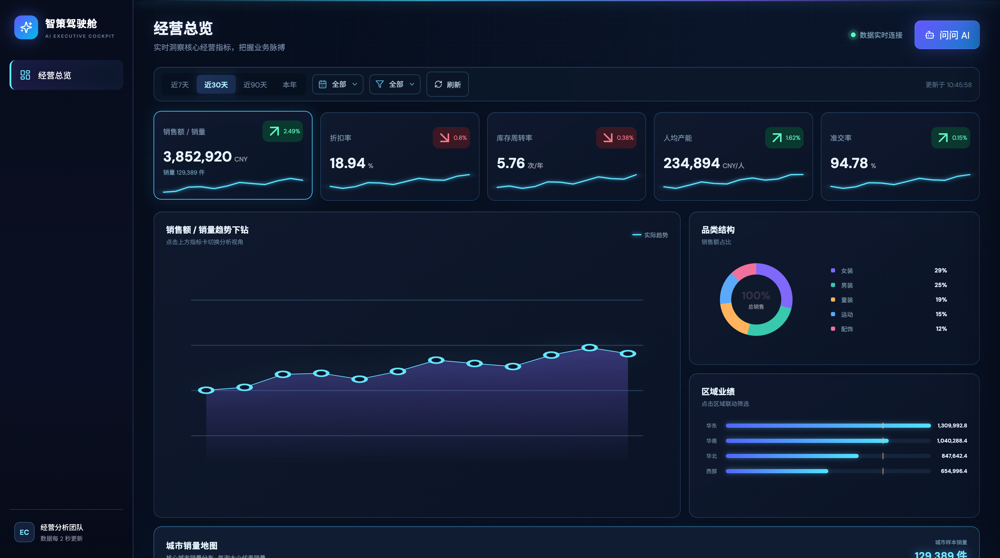
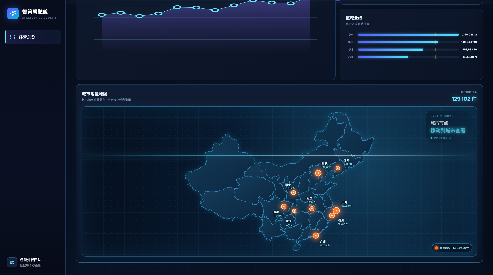
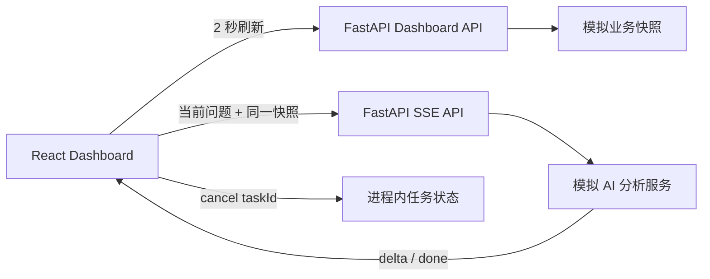

# AI Executive Cockpit

一个面向服装经营场景的 AI 智能经营驾驶舱 Demo。项目重点展示数据大屏、前端工程拆分、FastAPI 服务设计，以及复杂 SSE 流式交互。




> 当前使用模拟经营数据和模拟 AI 服务，不接入企业数据、真实大模型或长期聊天记忆。

## 核心能力

- 五项经营指标：销售额 / 销量、折扣率、库存周转率、人均产能、准交率
- 近 7 天、30 天、90 天和本年时间范围
- 区域、品类筛选及图表联动
- 点击指标卡下钻到对应趋势
- 每 2 秒刷新业务快照
- AI 经营问答与 SSE 流式输出
- 超时、自动重试、取消、错误和重复请求处理
- Dashboard 与 AI 共享同一份业务快照

## 技术栈

- Frontend：React 18、TypeScript、Vite 5、Lucide React
- Backend：Python 3、FastAPI、Pydantic、Uvicorn
- Test：Pytest、TypeScript Compiler、Vite production build
- Runtime：Node.js 20+

## 架构与逻辑拆分

```text
frontend/src
├── api/          HTTP 与 SSE 通信
├── components/   指标、图表、AI 对话组件
├── hooks/        Dashboard 与对话状态逻辑
├── pages/        页面编排
└── types/        前后端数据契约

backend/app
├── api/routes/   Dashboard、Chat、Cancel 接口
├── core/         Demo 配置
├── schemas/      请求与响应模型
├── services/     模拟数据、AI 契约与 AI 适配器
└── state/        进程内任务状态
```



## 本地运行

### 1. 启动后端

```bash
cd backend
python3 -m venv .venv
source .venv/bin/activate
pip3 install -r requirements.txt
python3 -m uvicorn app.main:app --reload --port 8000
```

后端地址：`http://localhost:8000`，健康检查：`GET /health`。

### 2. 启动前端

```bash
cd frontend
pnpm install
pnpm dev
```

前端地址：`http://localhost:5173`。Vite 会将 `/api` 代理到本地 FastAPI。

如需使用其他后端地址，可设置：

```bash
VITE_API_BASE_URL=http://localhost:8000 pnpm dev
```

## 验证

```bash
cd backend
python3 -m pytest -q

cd ../frontend
pnpm build
```

## SSE 事件

一次问答使用唯一 `requestId`，事件序列如下：

```text
start → delta... → done
              ├→ retry → delta... → done
              ├→ timeout
              ├→ cancelled
              └→ error

重复 requestId → duplicate
```

`done` 事件包含回答依据 `evidence` 和能力限制 `limitations`，便于说明 AI 结论来自当前模拟快照。

## 状态边界

- Conversation State：仅保存在当前 React 页面运行时，刷新后清除。
- Task State：仅保存在 FastAPI 进程内，用于幂等、取消和终态判断。
- Agent State：只存在于单次模拟分析和 SSE 输出期间。
- Business State：根据筛选条件和 2 秒时间桶生成模拟快照。
- 不使用聊天历史作为长期记忆，不写入数据库。

## 15 秒演示脚本

1. 展示五项核心指标及动态图表。
2. 切换时间范围，点击区域或品类完成联动。
3. 点击指标卡，展示对应指标趋势下钻。
4. 打开“问问 AI”，发送经营问题并展示 SSE 流式回答。
5. 点击停止或输入“模拟超时”，展示取消与重试处理。

演示视频已保存为 [`docs/assets/demo.mp4`](docs/assets/demo.mp4)：

<video src="docs/assets/demo.mp4" controls muted width="100%"></video>

## 系统边界

当前版本不包含管理端、企业数据接入、用户与权限、数据库、监控和审计。项目定位为可本地运行、代码托管于 GitHub 的面试展示 Demo。

## 第三方地图数据

中国省级 SVG 地图来自 [`@svg-maps/china`](https://github.com/VictorCazanave/svg-maps/tree/master/packages/china)，采用 CC BY 4.0 许可。

## 关键决策

| 决策                     | 原因                                                 |
| ------------------------ | ---------------------------------------------------- |
| React + Vite             | 对齐当前前端技术栈要求，并保持快速构建体验           |
| FastAPI 分层服务         | 分离接口、模型、业务逻辑和运行状态，便于替换模拟实现 |
| Dashboard 与 AI 共享快照 | 防止页面指标与 AI 回答口径不一致                     |
| 进程内任务状态           | Demo 不需要数据库、多实例恢复或长期会话              |
| 模拟 AI 通过契约适配     | 当前不接真实模型，同时保留未来替换实现的清晰边界     |
